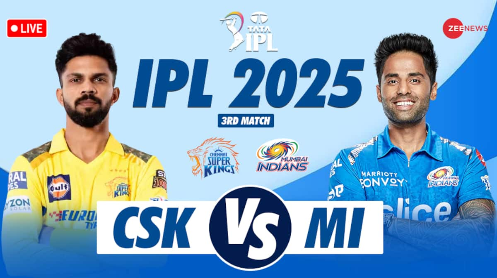
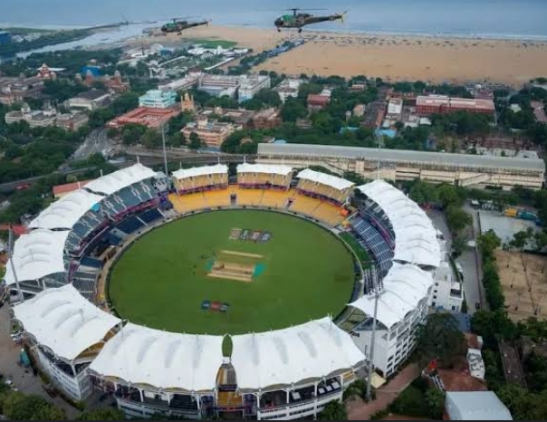
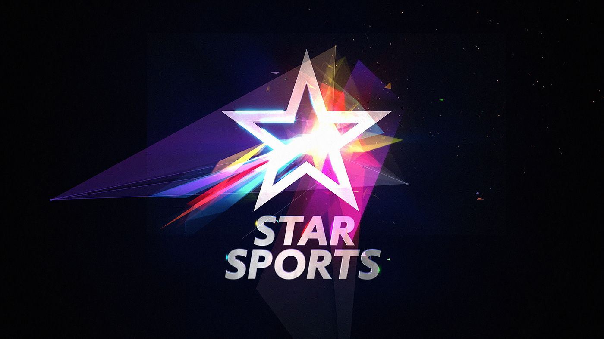
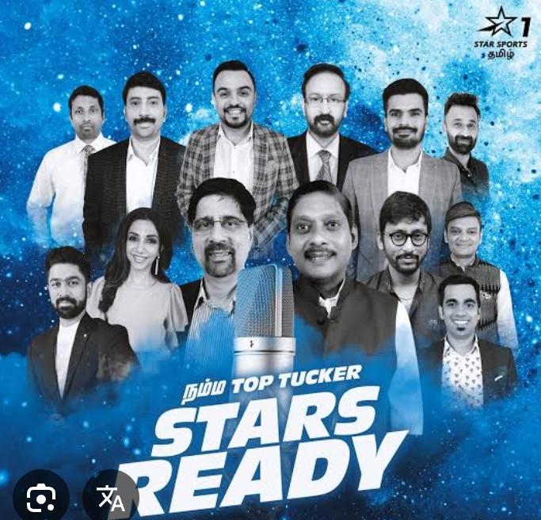

<!DOCTYPE html>
<html>
    <head>
        <title> CSK VS MI </title>
        <link rel="stylesheet" href="style.css">
    </head>
    
    

    <body>
    
 <h1>CSK VS MI</h1>   
     

     
 CSK VS MI is one of the biggest rivalries and it is the most watched by the audience and its going to be the greatest match ever in ipl history
        and the two biggest captains in the world <a href="https://timesofindia.indiatimes.com/sports/cricket/ipl/top-stories/ipl-2022-in-numbers-ms-dhoni-an-ipl-colossus-a-legendary-finisher/articleshow/91001458.cms"> MAHENDRA SINGH DHONI </a> and <a href="https://www.sportsvirals.com/rohit-sharma-ipl-runs/"> ROHIT SHARMA </a> who both won the T20 world cup and the test mase and dhone have made history by collecting all formet trophies
        and also they have won five trophies each in just 15 seasons of IPL history and the most beautiful thing is that the two teams have a gun team as top orders and the bowling attack is one of the OG 
        bowling attack if you want to see DHONI for the last time its your time book tickets.
    

    

    
    <h2> Venue: </h2>  
    
  

    
 
        CSK VS MI is one of the biggest rivalries and it is the most watched by the audience and the match will be held at <a href="https://youtube.com/shorts/T2NMemRvuXU?si=EXokABRgi9V4nT5S"> chennai chepauk cricket stadium </a> which is one of the toughest stadium in india and this pitch helps 
        the spinners, it is a turning track and the pitch has more cracks, it helps the spinners more and it is dry pitch and the batters struggles more to face the spinners, it is low scoring pitch and 
        is mostly favoruble for the first batting team. dont miss out this chance and book the tickets and watch your favorute players.
    

    <h2> Timing: </h2>  
    

        CSK VS MI match at chennai chapauk stadium will be commence by 7.30 pm on 7th july 2025.
    

    
    <h2> CSK Squad: </h2>
    <ol>
        <li> <a href="https://www.espncricinfo.com/cricketers/ayush-mhatre-1452455">AYUSH MATRE </a> </li>
        <li> <a href="https://www.espncricinfo.com/cricketers/sanju-samson-425943"> SANJU SAMSON </a> </li>
        <li> <a href="https://www.espncricinfo.com/cricketers/ruturaj-gaikwad-1060380"> RUTURAJ GAIKWAD  </a> (c)  </li>
        <li> <a href="https://www.espncricinfo.com/cricketers/urvil-patel-1131570"> URVIL PATEL </a> </li>
        <li> <a href="https://www.espncricinfo.com/cricketers/dewald-brevis-1070665"> DEWALD BREVIS </a> </li>
        <li> <a href="https://www.espncricinfo.com/cricketers/shivam-dube-714451"> SHIVAM DUBE </a> </li>
        <li> <a href="https://www.espncricinfo.com/cricketers/ms-dhoni-28081"> MAHENDRA SINGH DHONI </a> (wk) </li>
        <li> <a href="https://www.sportskeeda.com/player/akeal-hosein"> AKIL HUSSAIN </a> </li>
        <li> <a href=" https://www.espncricinfo.com/cricketers/anshul-kamboj-1175428"> ANSHUL KAMBOJ </a> </li>
        <li> <a href="https://www.espncricinfo.com/cricketers/noor-ahmad-1182529"> NOOR AHMADH </a> </li>
        <li> <a href="https://www.espncricinfo.com/cricketers/khaleel-ahmed-942645"> KHALEEL AHMAD </a> </li>
        <li> <a href="https://www.espncricinfo.com/cricketers/matheesha-pathirana-1194795"> MATHEESHA PATHIRANA </a> (Impact player) </li>
    </ol>

    <h2> MI Squad: </h2>
    <ol>
        <li><a href="https://www.espncricinfo.com/cricketers/rohit-sharma-34102"> ROHIT SHARMA </a> </li>
        <li> <a href="https://www.espncricinfo.com/cricketers/jonny-bairstow-297433"> JONNY BAIRSTOW </a> </li>
        <li> <a href="https://www.espncricinfo.com/cricketers/will-jacks-897549"> WILL JACKS </a> </li>
        <li><a href="https://www.espncricinfo.com/cricketers/tilak-varma-1170265"> TILAK VARMA </a> </li>
        <li> <a href="https://www.espncricinfo.com/cricketers/suryakumar-yadav-446507">SURYA KUMAR YADAV </a> </li>
        <li> <a href="https://www.espncricinfo.com/cricketers/hardik-pandya-625371">HARDIK PANDYA </a></li>
        <li><a href="https://www.espncricinfo.com/cricketers/sherfane-rutherford-914541"> SHERFANE RUTHERFORD </a></li>
        <li> <a href="https://www.espncricinfo.com/cricketers/shardul-thakur-475281">SHARDHUL THAKUR</a> </li>
        <li><a href="https://www.espncricinfo.com/cricketers/ashwani-kumar-1209126"> ASHWANI KUMAR </a></li>
        <li> <a href="https://www.espncricinfo.com/cricketers/trent-boult-277912">TRENT BOULT </a></li>
        <li> <a href="https://www.espncricinfo.com/cricketers/jasprit-bumrah-625383">JASPRIT BUMRAH </a></li>
        <li> <a href="https://www.espncricinfo.com/cricketers/deepak-chahar-447261">DEEPAK CHAHAR </a>(Impact player) </li>
    </ol>
    <h1> Telecast: </h1>
    
  

    

        CSK VS MI the most popular and the biggest rivilries and this match will be telecasted on <a href="https://www.instagram.com/starsportstamil/?hl=en"> StarspotsTamil </a> and the this telecasting starts 
        from 6 pm on 7th july 2025.
    

    
    <h2> Commentry: </h2>  
    
 

    

        For the match CSK VS MI will be telecasted on StarSpotsTamil by 6 pm and the comentry will starts by 6 pm and the commentators are <a href="https://www.instagram.com/reel/DQHTXkuEu7Z/"> RJ BALAJI </a> , <a href="https://www.instagram.com/reel/DRCNKlnkcIO/"> SADAGOPAN RAMESH </a>, <a href="https://www.instagram.com/supermuthu/?hl=en"> MUTHU </a>, <a href="https://www.instagram.com/cheekaofficial/?hl=en"> KRISHNAMACHARI SRIKKANTH </a>, <a href="https://www.instagram.com/reel/DQ30K4OEVR-/"> ANIRUDHA SRIKANTH </a>.
    

    

    
 <a href="book.html"> <button style="background-color: blue; color: white;">Book Tickets</button> </a>
    </body>
    

</html>
